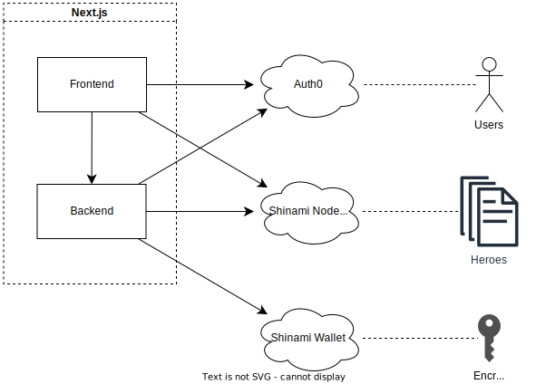

# Shinami demo app

An _imaginary_ game built on top of [Shinami](https://shinami.com) services and [Sui](https://sui.io/).

This is a [Next.js](https://nextjs.org/) project bootstrapped with [`create-next-app`](https://github.com/vercel/next.js/tree/canary/packages/create-next-app).
It uses [Shinami TypeScript SDK](https://www.npmjs.com/package/shinami) to read from and write to the Sui blockchain.

## Highlights

- Social sign in experience, powered by [Shinami invisible wallet](https://www.shinami.com/invisible-wallet) and [Auth0](https://auth0.com/).
  - Adaptable to other 3rd party or custom auth providers.
- In-game heroes as player-owned on-chain objects, with evolving attributes.
- Sponsored transactions powered by [Shinami gas station](https://www.shinami.com/gas-station).

## Architecture



The core app consists of two parts:

- The backend, implemented as [Next.js API routes](https://nextjs.org/docs/pages/building-your-application/routing/api-routes), is under [pages/api](pages/api/).
  - Runs on a server with Node.js runtime.
  - Communicates with Shinami invisible wallet services, while safeguarding wallet secrets locally.
  - Responsible for Sui transaction executions that mutate hero states.
- The frontend, implemented as [Next.js pages](https://nextjs.org/docs/pages/building-your-application/routing/pages-and-layouts) (React components), is everything else under [pages](pages/).
  - Runs in players' browsers.
  - Reads hero states from the Sui blockchain, through [Shinami node service](https://www.shinami.com/node).
  - Integrates with external auth provider.

Notably, the core app doesn't require its own database to operate, even though many players can sign up and mint and evolve their heroes.
All operating states are maintained by these external infra:

- The Sui blockchain itself, where all hero states are maintained.
- Shinami invisible wallet, where _encrypted_ copies of wallet keys are securely kept.
- Auth0, where players' sign-in information is maintained.

### Wallet management

There are two types of wallets used in this demo app:

- A single _admin wallet_. This manages access to the Sui account used by backend server(s) to run admin operations.
- A separate _player wallet_ for each signed-in user. They manage ownership of each piece of in-game asset, e.g. heroes.

Both are facilitated by Shinami invisible wallet service.

## Move package design

See [Move README](move/README.md).

## Development

All env variables required to run this demo app are listed in [.env](.env).
You must fill them in `.env.local` file, which should not be committed to git.

Assuming you have published your own copy of the [Move package](move/), you would have known the Sui network, package id, and have received a `sui::package::Publisher` object.
Next thing is to mint a `hero::AdminCap` object.

```bash
# Start the development server
npm run dev

# From another shell, obtain your admin wallet address
# This address is unique per Shinami account
curl http://localhost:3000/api/admin/wallet

# Mint and transfer an admin cap
# Must run from the same Sui address that published the package
sui client call \
  --package "<PACKAGE_ID>" \
  --module hero \
  --function new_admin_cap_to_recipient \
  --args "<PUBLISHER_ID>" "<ADMIN_WALLET_ADDRESS>" \
  --gas-budget 10000000
```

You can grab the admin cap object id from the output and set `ADMIN_CAP` in your `.env.local` file.
Note that this must be a different instance on every development or deployment server you run the backend on, to avoid [equivocation](https://docs.sui.io/learn/sui-glossary#equivocation).

Open [http://localhost:3000](http://localhost:3000) with your browser to see the result.
You can start editing the page by modifying [pages/index.tsx](pages/index.tsx).
The page auto-updates as you edit the file.
